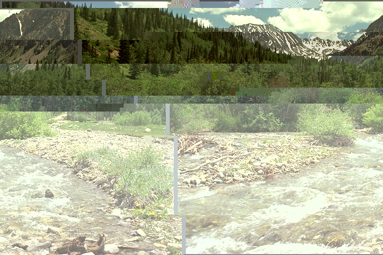

# JpegGlitcher

It's glitching time!

`JpegGlitcher` offers uniquely the `glitch` function.
`glitch` will take an image, compress it using the JPEG encoding, safely modify some
bytes of the compressed version and return the disencoded version.

Here is an example, showing the evolution over time:

```julia
using JpegGlitcher
using Random, FileIO, TestImages

img = testimage("mountainview")
glitch(img)
```



We can also make an animation!

```julia
cat([glitch(img; rng = Random.Xoshiro(42), n = i, quality = 20) for i in 1:50]...; dims=3)
```

